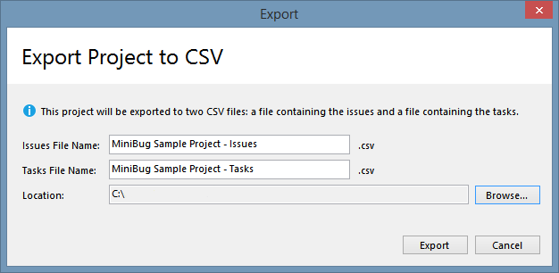
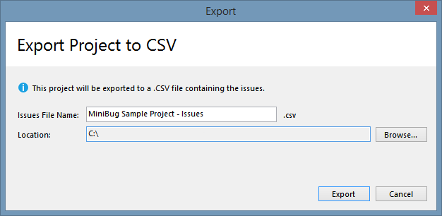

# MiniBug - Issue Tracker and To-do List

MiniBug is a barebones, simple issue tracker and to-do list. It is a Windows desktop single-user application.

MiniBug does not use a database to store data: instead the application stores each project in a .json file. This means that if you need to work on projects, in different computers, you can share a MiniBug project between computers, by putting the .json file in something like Dropbox.

## Features

- Issues: create, edit, delete, clone
- Tasks: create, edit, delete, clone
- Show/hide/sort columns
- Some user defined settings
- Export issues and tasks to CSV format

## Sample project

I've made a small sample project, with bugs and tasks copied from some applications' public bug trackers (Inkscape, Firefox, MariaDB and Kodi).

Download the file <a href="minibug-MiniBug Sample Project.json">minibug-MiniBug Sample Project.json</a> and open it in MiniBug.

# Getting Started

## Prerequisites

- Microsoft Windows 7 (maybe it works on older versions but I haven't tested)
- Microsoft .NET Framework 4.6.1

# How To Use

First you need to create a new project (File > New Project), define a project name and choose a location to save it:

Next you can start adding issues and tasks:
- issues are bugs/problems
- tasks are items in a to-do list

## Issues

## Tasks

## Settings

The user can modify some settings (File > Settings) in order to customize the look and feel of the application:

Settings in action:

## Sorting

You can sort the grid rows in two ways:

- by clicking on a column header:

- by using the **Configure Columns** window:

Using the second method you can sort by up to two columns and with different criteria (ascending or descending).

## Column visibility

You can show/hide any column (except the **ID** column, which is always visible), using the **Configure Columns** window:

## Exporting

You can export a project's issues and tasks to CSV (comma separated values) files:

Because issues and tasks have a slightly different structure, they are exported to separate files. If a project only has issues or tasks, only one file will be generated:

# License

This project is licensed under the MIT License - see the LICENSE.md file for details.

# Acknowledgments

This project uses the following libraries:

- <a href="https://www.newtonsoft.com/json">Json.NET</a>: for reading/writing to .json files
- <a href="https://joshclose.github.io/CsvHelper/">CsvHelper</a>: for exporting to CSV