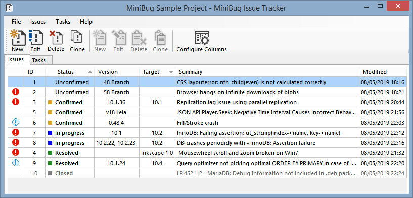
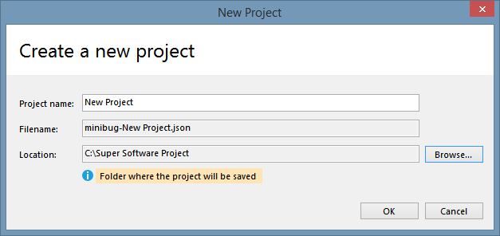
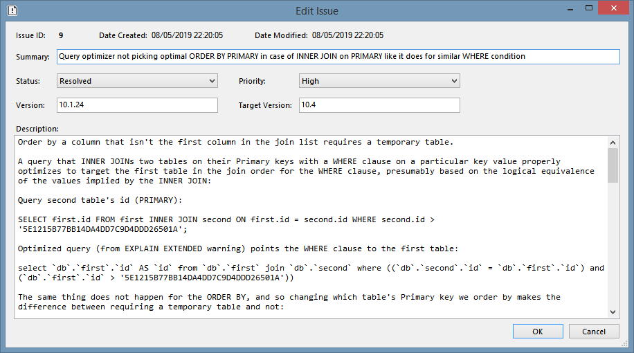
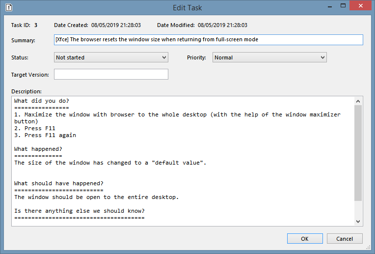
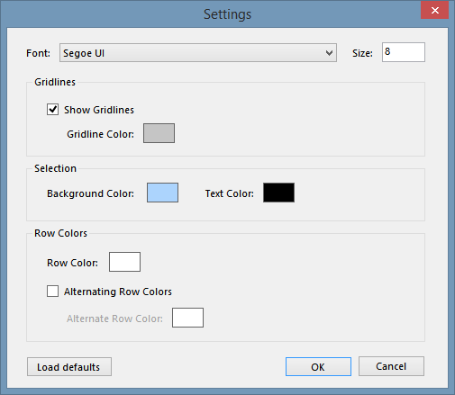
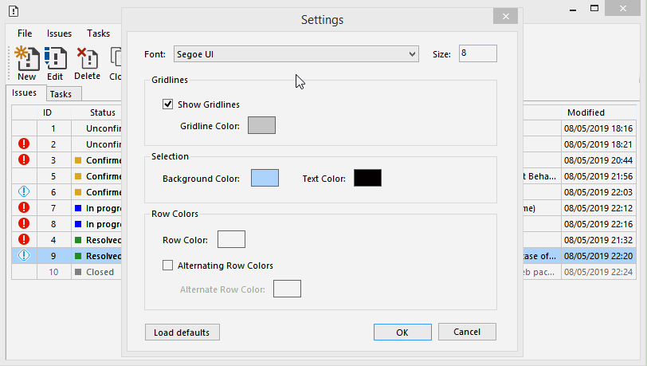
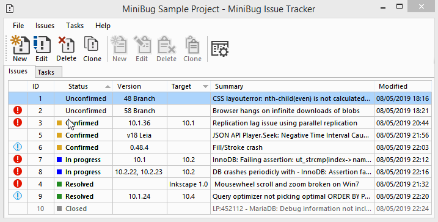
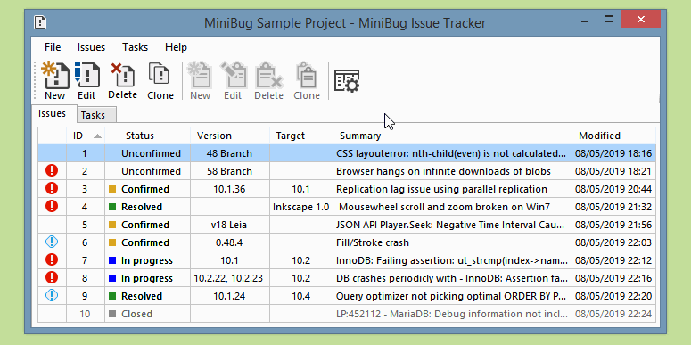

# MiniBug - Issue Tracker and To-do List

MiniBug is a barebones, simple issue tracker and to-do list. It is a desktop single-user application.

## Features

- Issues: create, edit, delete, clone
- Tasks: create, edit, delete, clone
- Show/hide/sort columns
- Some user defined settings
- Export issues and tasks to CSV format

## Sample project

I've made a small sample project, with bugs and tasks that I copied from some applications public bug trackers (Inkscape, Firefox, MariaDB and Kodi).

Download the file <a href="minibug-MiniBug Sample Project.json">minibug-MiniBug Sample Project.json</a> and open it in MiniBug.

# How To Use

First you need to create a new project (File > New Project), define a project name and choose a location to save it:

Next you can start adding issues and tasks:
- issues are bugs/problems
- tasks are items in a to-do list

## Issues

## Tasks

## Settings

The user can modify some settings (File > Settings) in order to customize the look and feel of the application:

Settings in action:

## Sorting

You can sort the grid rows in two ways:

- by clicking on a column header:

- by using the **Configure Columns** window:

Using the second method you can sort by up to two columns and with different criteria (ascending or descending).

## Column visibility

You can show/hide any column (except the ID column which is always visible):

